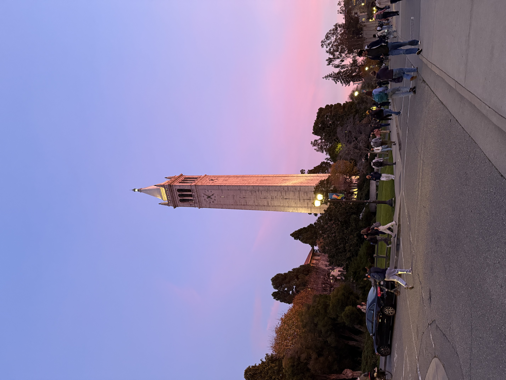
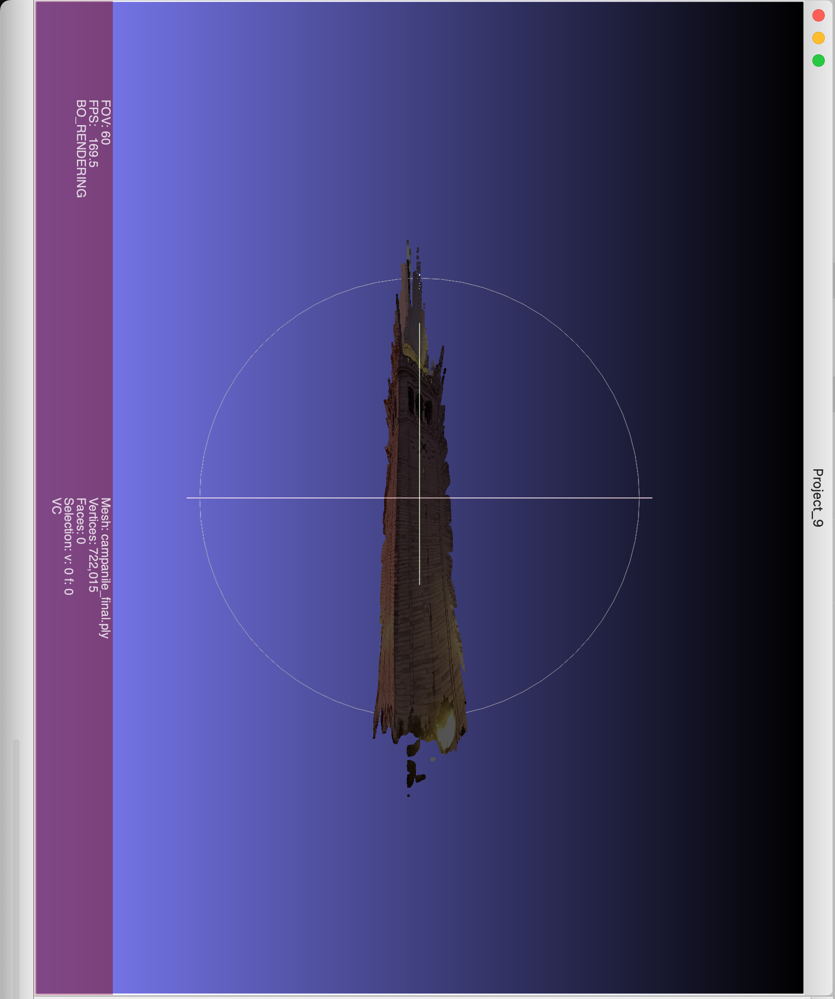

# Depth-Anything-SAM2
3D Point Cloud reconstruction from a single 2D image using **SAM 2** and **Depth Anything V2**.

## 🚀 Results
| Original Image | SAM 2 Mask | 3D Point Cloud |
| :--- | :--- | :--- |
|  |  |  |

## 🛠 Project Structure
- `src/`: Main Python scripts for depth estimation and projection.
- `data/`: Input images.
- `assets/`: Result images and screenshots.
- `checkpoints/`: Model weights (e.g., `sam2_hiera_small.pt`).

## 📖 How it Works
1. **Segmentation**: Using SAM 2 to isolate the specific object (e.g., the tower).
2. **Depth Map**: Running Depth Anything V2 to get a monocular depth estimation.
3. **Projection**: Applying a pinhole camera model to project 2D pixels into 3D space based on the depth values.

## 💻 Setup
1. Clone the repo.
2. Install SAM 2 and Depth Anything V2 requirements.
3. Place model checkpoints in the `/checkpoints/` folder.
4. Run: `python src/run_reconstruction.py`
